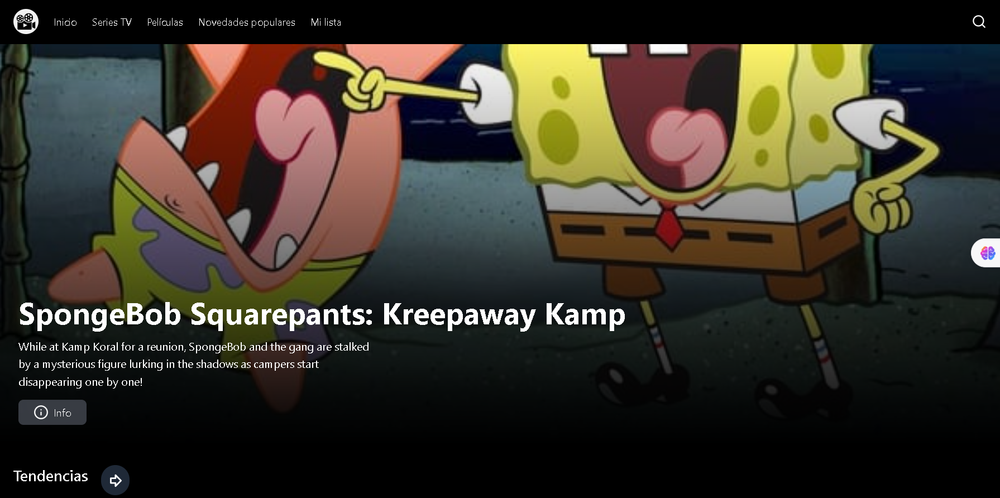
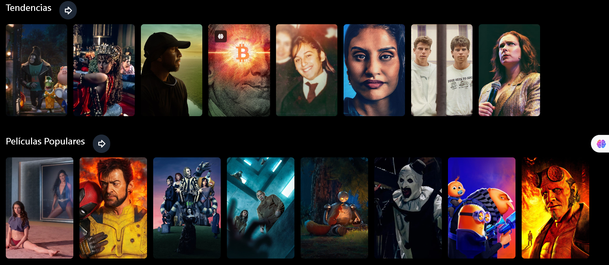
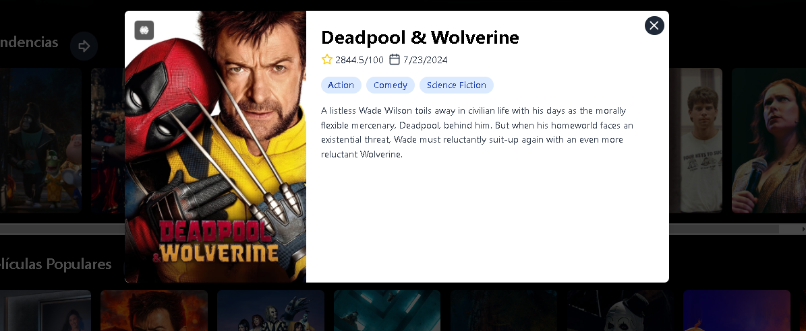
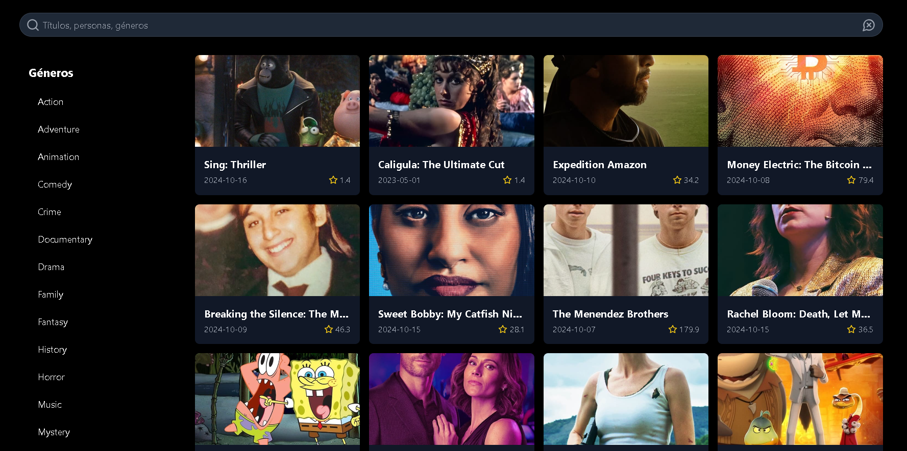

# Netflix Clone

  

Bienvenido a mi **Netflix Clone**, una aplicación construida con **React.js** que utiliza **Tailwind CSS** para el diseño y la **API de TMDB** para obtener datos de películas.

---

## 📖 Descripción

Este proyecto es un clon de Netflix que permite a los usuarios explorar películas y series, ver detalles de cada título y realizar búsquedas personalizadas. Actualmente, la aplicación muestra las películas más populares y las tendencias del momento.

---

## 🌐 Home

En la página de inicio, los usuarios pueden ver la película de portada, que se selecciona de forma aleatoria. Ten en cuenta que, aunque el navbar no es funcional debido a que las rutas no están definidas, el botón de búsqueda sí permite realizar búsquedas efectivas.



---

## 🎬 Películas

La sección de películas muestra una lista de títulos en dos categorías: **Trending** y **Popular**. Actualmente, hay 20 películas por cada categoría, pero planeo añadir más en futuras actualizaciones.



---

## 📽️ Detalle de Película

Al hacer clic en una película, aparece un **modal** con más información sobre el título seleccionado. Esta sección incluye detalles como el género, la calificación, la fecha de estreno, entre otros.



---

## 🔍 Búsqueda

La funcionalidad de búsqueda permite a los usuarios filtrar las películas por género o título. Esta característica facilita la exploración del contenido disponible.



---

## 🚀 Próximamente

En la próxima versión del proyecto, se incluirán las siguientes características:
- Integración de series.
- Navbar funcional con rutas definidas.
- Mejoras en la experiencia de usuario y en el diseño de la página.

---

## 💻 Tecnologías Utilizadas

- **React.js**: Biblioteca de JavaScript para construir interfaces de usuario.
- **Tailwind CSS**: Framework CSS para un diseño moderno y responsivo.
- **TMDB API**: API para obtener datos sobre películas y series.

---

## 🎯 Cómo Ejecutar el Proyecto

1. Clona el repositorio:
   ```bash
   git clone https://github.com/odiseo153/Netflix_Clone.git
   cd Netflix_Clone
   npm install
   npm run dev
